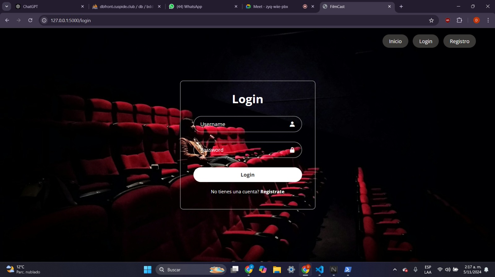
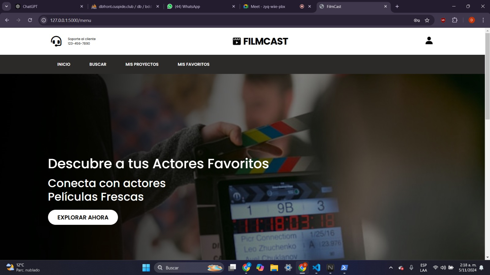
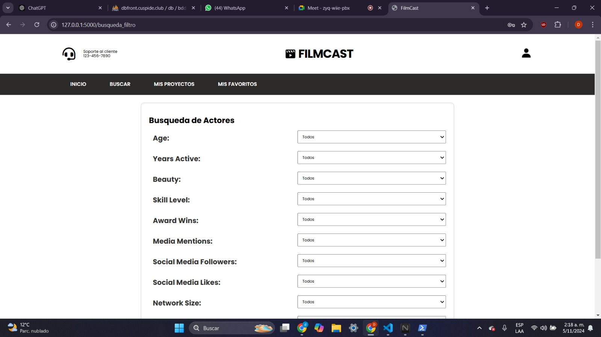
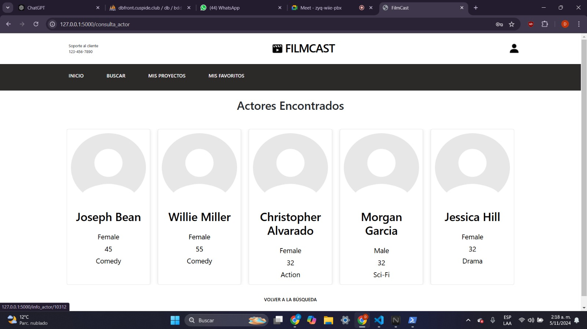
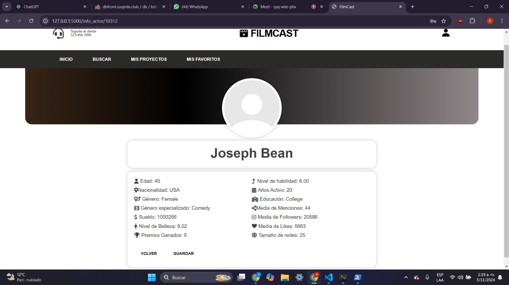
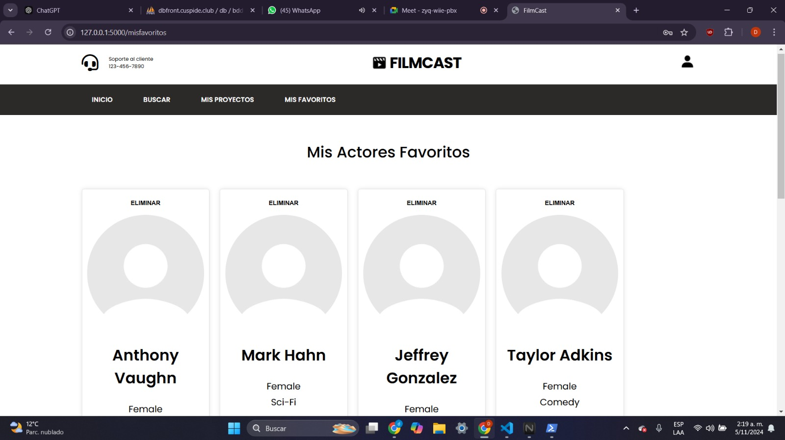
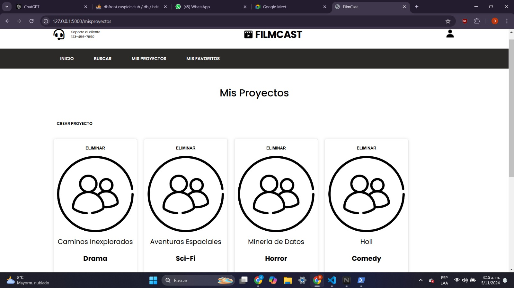
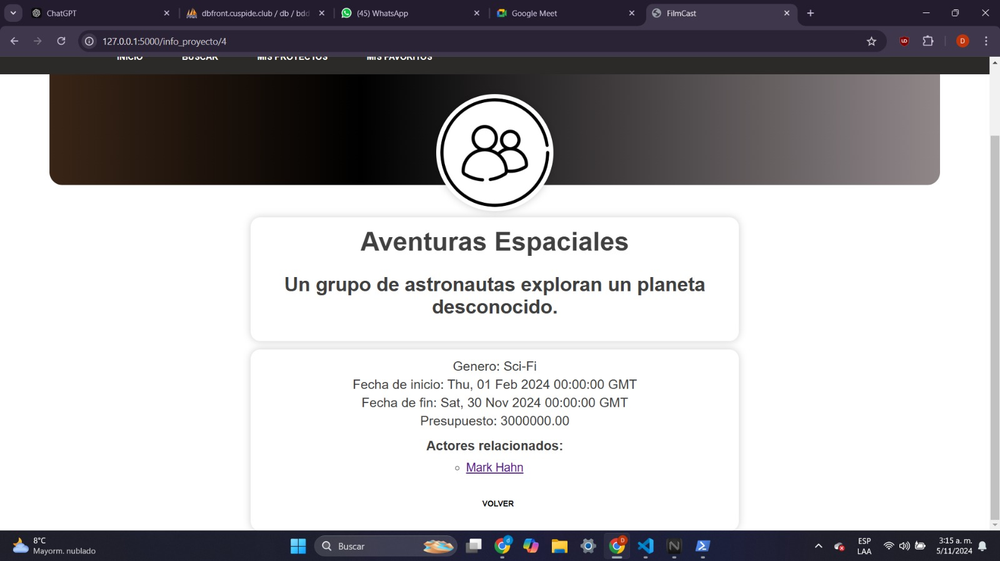
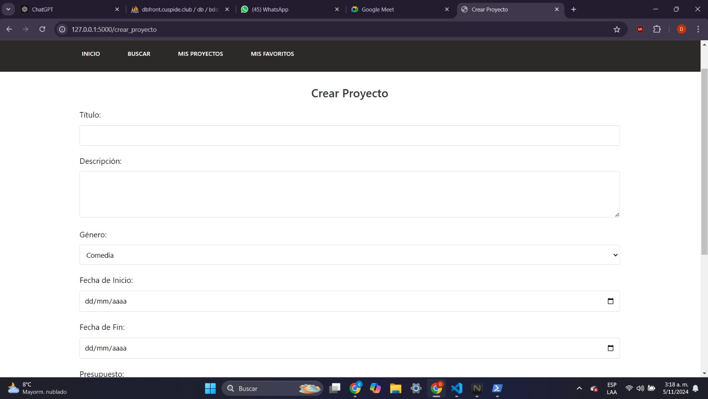

# Tabla de Contenidos

- [Filmcast](#filmcast)
- [Integrantes Minería de Datos](#proyecto-de-minería-de-datos)
- [Integrantes Aplicaciones Móviles](#proyecto-de-aplicaciones-móviles)
- [Aplicación Web](#aplicativo-web)
- [Aplicación Móvil](#aplicación-móvil)
- [Modelo KNN](#modelo-de-minería-de-datos)

# Filmcast


Filmcast está dedicado para aquellos directores que quieren tener recomendaciones de actores y actrices de acuerdo a diferentes características que el director quiera. 

Desarrollar una aplicación móvil que permita a los productores conectar y comunicarse de manera eficiente con actores, utilizando un modelo que encuentre al mejor actor haciendo uso de un modelo de regresion lineal, con el fin de identificar y mostrar perfiles que se ajusten a los requerimientos específicos de los proyectos audiovisuales.

## Proyecto de Minería de Datos
- Alaix Perez Andrés

- Alvarado Becerra Ludwig

- Chocontá Rojas Daniela

- Martínez Guerrero Juan José

## Proyecto de Aplicaciones Móviles

- Alaix Perez Andrés Julián

# Aplicativo Web

Para acceder a la web, puede utilizar el siguiente enlace [https://filmcast.cuspide.club/](https://filmcast.cuspide.club/), toda la infraestructura es propia de los autores.

## Login

Esta función gestiona el inicio de sesión en nuestra aplicación de manera que cuando un usuario envía sus credenciales, se realiza una solicitud a la API de autenticación. Si la respuesta es positiva y se recibe un token, lo almacenamos en la sesión junto con los datos del usuario, posteriormente lo redirigimos al menú principal. Si llega a presentarse un error como que no se reciba el token o que ocurra un problema durante la solicitud, capturamos el error y lo mostramos en la plantilla de inicio de sesión, si encambio la solicitud es solo para mostrar el formulario, simplemente renderizamos la página de inicio de sesión.




## Inicio

Al ser redirigido a la vista del menú, se encontrara un acceso directo al Inicio, así como un enlace a la Búsqueda, que llevará al formulario para encontrar actores. También hay una sección dedicada a Mis Favoritos, donde se podrás ver la información de los actores preferidos. Del mismo modo, se tendrás acceso a Mis Proyectos, donde se podrá explorar el contenido que el usuario ha creado. Por último, se presentará una sección con tarjetas de Actores Recomendados, donde se podrá acceder a los perfiles de cada uno de ellos.





## Búsqueda

Al acceder a la vista del formulario de búsqueda de actores, el usuario podra realizar búsquedas específicas a través de varios criterios relacionados con los actores y escoger sus preferencias. Una vez hecho esto se redirigirá al usuario a la pantalla de actores encontrados donde se le envio los valores de las preferencias a la api del modelo, y este devuelve los actores mas cercanos y recomendados para su búsqueda.



## Resultados

Aqui se imprimira la informacion de los actores recomendados para la busqueda del usuario y este podra acceder al perfil de cada uno de los recomendados al dar click encima a la tarjeta del actor.



## Información del actor

En esta pantalla se imprimira todos los datos del actor seleccionado donde podremos guardarlo en favoritos, si el actor ya esta guardado se imprimira un mensaje de aviso, toda la informacion viene de la solicitud a la api con el id.



## Actores favoritos

Cada vez que el usuario entra a un perfil de actor tiene la posibilidad de guardarlo, esta informacion se envia a la api donde se registra en la base de datos y al entrar en la pantalla favoritos se dara la informacion de todos los actores guardados por el usuario, en esta se puede entrar a los perfiles o eliminar a los actores de favoritos.



## Mis proyectos

En esta encontraremos toda la informacion de los proyectos creados por el usuario, apareceran como tarjetas y se pueden eliminar o entrar para ver su informacion, esto gracias a que se llama a la función obtener_proyectos_por_usuario, pasando el usuario_id y el token para obtener la lista de proyectos asociados a ese usuario,  ademas de contar con un apartado de crear proyecto que lleva al usuario a la vista de crear proyecto.



## Información de proyectos

Aquí se muestra toda la información del proyecto, incluyendo los actores relacionados, cuyos perfiles se pueden visualizar al seleccionarlos.



## Crear proyecto

El formulario para crear un nuevo proyecto cinematográfico, pide la infromacion del proyecto como Título Descripción, Género, Fecha de inicio y fecha de fin, Presupuesto, Actores a relacionar que trae una lista de actores que se pueden elegir para participar en el proyecto, solo se muestran como opcion los actores guardados en favoritos y finalmente se pide el Rol del Actor y se registra el proyecto enviando la info a la api y esta lo registra en la base de datos.




# Aplicación Móvil

# Modelo de Minería de Datos

El modelo busca los actores más cercanos de acuerdo a las características que el director requiera para su búsqueda. Utiliza el algoritmo de $k$ vecinos más próximos, en este caso estamos buscando los *5* vecinos más cercanos a un punto en el espacio, haga de cuenta la siguiente figura:

 


## Entrenamiento y uso del modelo

El modelo entrenado se encuentra en `Mineria de Datos/Model/Lud/app/knn_model.pkl`, para el entrenamiento se utilizó el set de datos `ActoresIndexOneHot.csv` ubicado en `Mineria de Datos/Model/Lud/app/ActoresIndexOneHot.csv` y el modelo fue generado en el archivo `Mineria de Datos/Model/Others/trainModel.py`. Se utiliza el algoritmo KNN para retornar los 5 actores que se ajustan más a la petición del director. La API del modelo se encuentra montada en `https://modelo.cuspide.club/find_neares_records` y se puede realizar una solicitud por medio de `curl` de la siguiente forma:

``` bash
curl -X POST https://model.cuspide.club/find_closest_actors \
  -H "Content-Type: application/json" \
  -H "Authorization: Bearer <your JWT token>" \
  -d '{
    "predecir": {
      "Age": [50, 55],
      "Years Active": [15, 20],
      "Beauty": [8, 9],
      "Skill Level": [7, 8],
      "Award Wins": [5, 7],
      "Media Mentions": [50, 70],
      "Social Media Followers": [30000, 35000],
      "Social Media Likes": [10000, 11000],
      "Network Size": [25, 30],
      "Income": [900000, 950000]
    }
  }'
```

Los valores que el usuario desea deben ser cambiados dentro de los arrays del JSON. Por ejemplo, el director quiere de un Actor que tenga edad de 50 a 55, entonces, la petición se ve `"Age": [50, 55]`. Así se aplica con todos los demás y modificando los valores, dando así una salida positiva de la siguiente manera:

``` bash
{"closest_indices":[5776,11578,3139,281,7152]}
```

Donde se retornan los indices de aquellos actores más cercanos. Así, se demuestra el funcionamiento de la API y del modelo.
